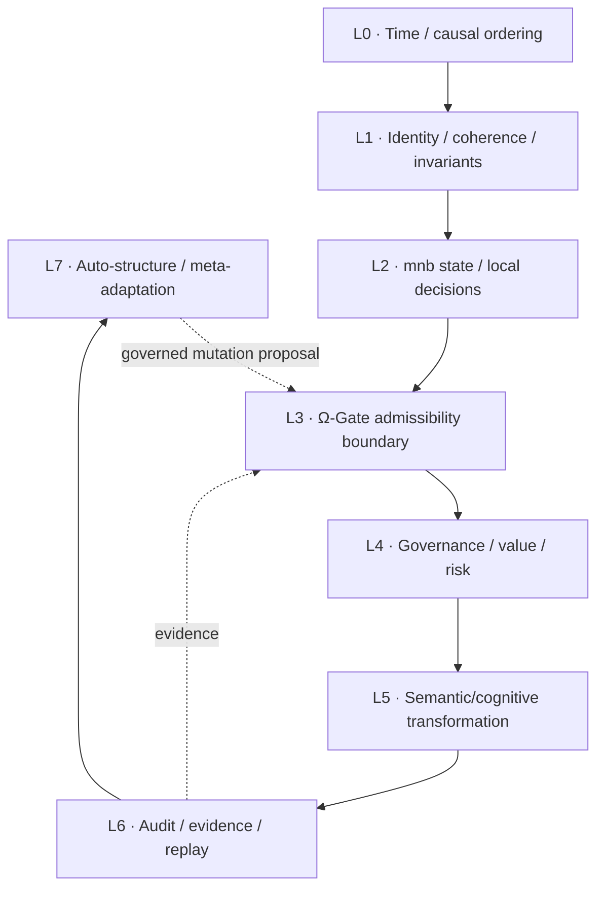
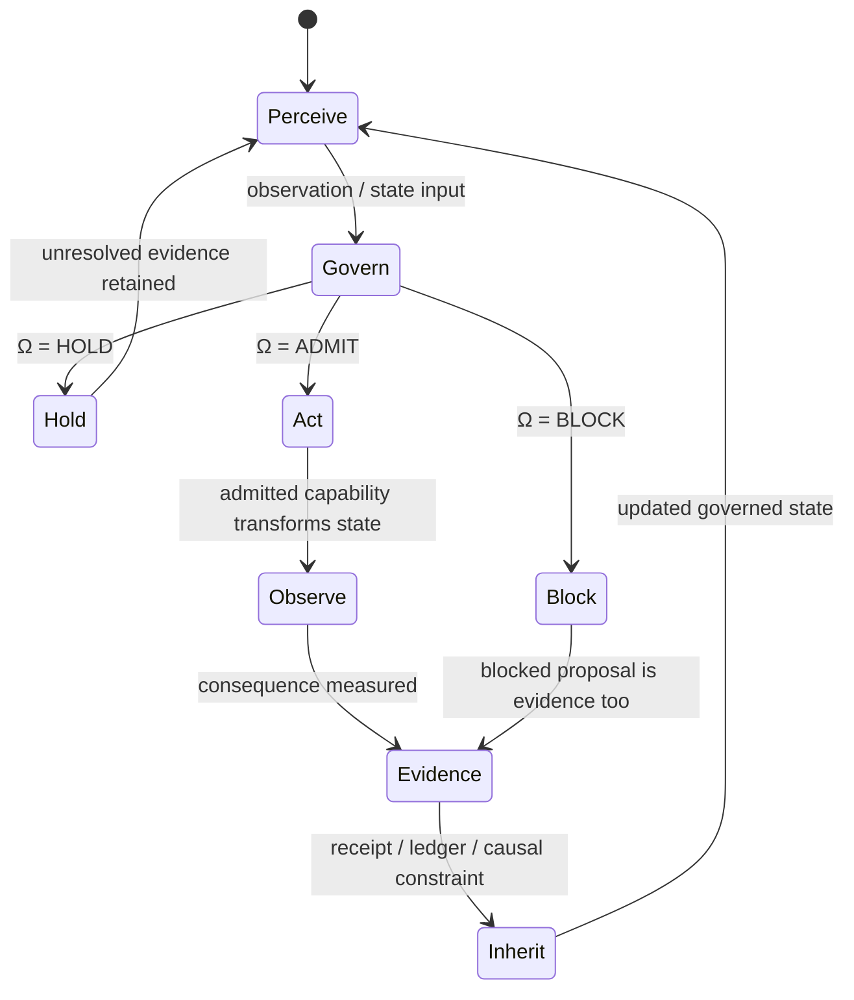
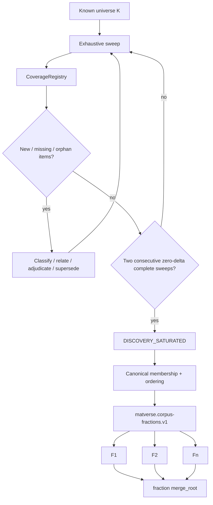
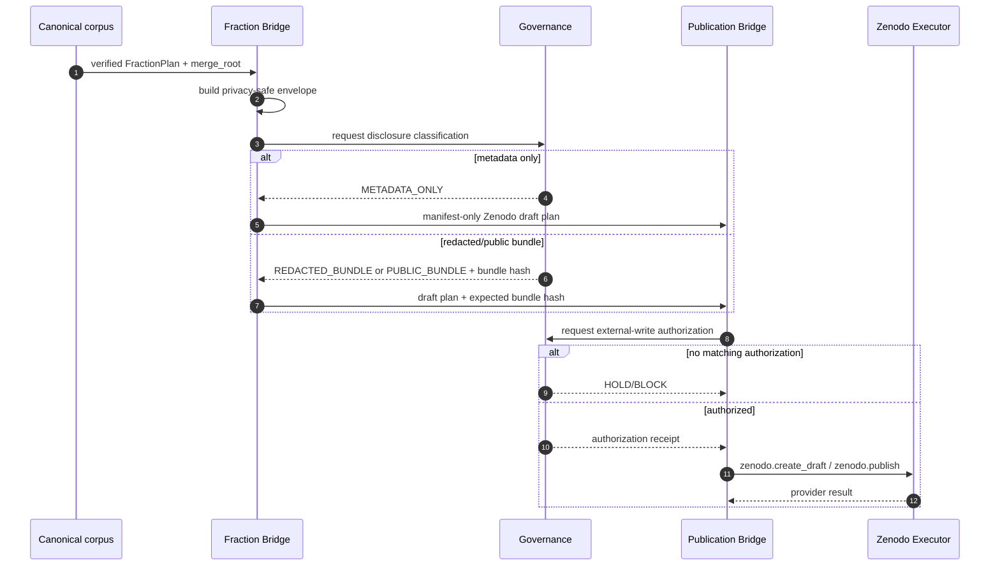
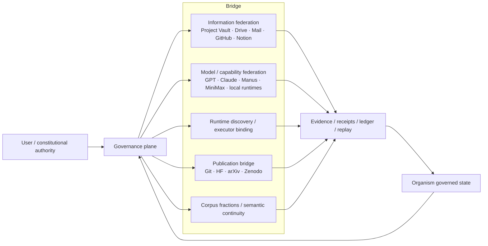

# MatVerse structural diagrams

These diagrams are documentation views over the current MatVerse architecture.
They are not evidence of scientific claims by themselves.

Canonical terminology used here:

- `mnb` = Mem-Nano-Bit, informational primitive/node.
- `mem-bit` = digital/contract representation.
- `m-bit` = physical/item representation.
- MatVerse = field of informational possibilities.
- Organism = governed information + admitted capabilities + causal continuity.
- Bridge = governed mediation/admission/transition mechanism across partitions,
  capabilities and substrates.

## 1. L0-L7 working structural view

The L0-L7 view is retained as a useful structural projection, not as a claim that
these eight layers are the only valid decomposition of MatVerse.



## 2. Organism physiology as a closed loop



The organism is not the model executing one step. The identity-bearing object is
its governed state, authority, lineage and admitted capability set.

## 3. Corpus fractions + No-Left-Behind



`DISCOVERY_SATURATED` is scoped: it means two complete sweeps over the same
registered partition set found no new or missing objects. It does not claim that
nothing exists outside the accessible universe.

## 4. Fraction publication governance



The `merge_root` proves structural integrity. It does **not** authorize disclosure.
Raw chats, private files or source bundles are never made public by default.

## 5. Complete Bridge planes



## 6. Ontological compression

```text
MatVerse   = informational possibility field
mnb        = localized informational primitive / node
Governance = admissibility boundary
Bridge     = governed admission + transition + mediation
Capability = possibility of transformation
Organism   = governed information + admitted capabilities + causal continuity
Physiology = causal exercise of admitted capabilities over governed information
Evidence   = record that a proposed/possible transition was actually evaluated or actualized
```
